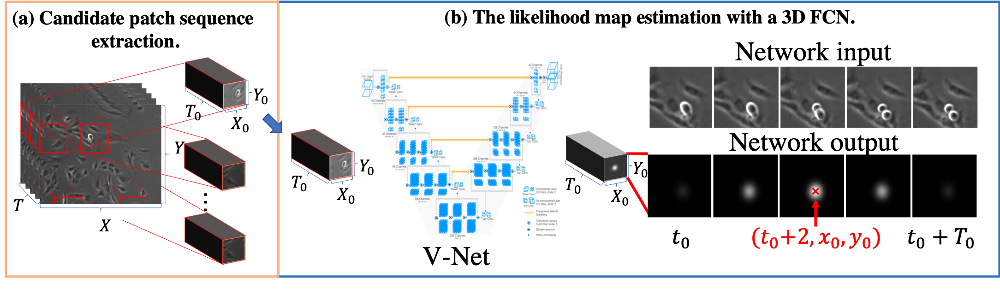

<h2 align="center"> Spatial-Temporal Mitosis Detection in Phase-Contrast Microscopy via Likelihood Map Estimation by 3DCNN <\h2>

[[Home]](http://human.ait.kyushu-u.ac.jp/index-e.html) [[Paper]](https://arxiv.org/abs/2004.12531) 



## Prerequisites
* System (tested on Ubuntu 18.04LTS)
* NVIDIA driver 430
* [Python>=3.6](https://www.python.org)
* [PyTorch>=0.4](https://pytorch.org)
* [MATLAB](https://jp.mathworks.com/products/matlab.html)

## Installation
Python setting

### Conda user
```bash
conda env create -f=requirement.yml
conda activate pytorch
```

### Docker user
```besh
docker build ./docker
sh run_docker.sh
```

## Data Preparation 

Please download data and annotation from follows web site and unzip all files and put on this folder.

https://media.m2i.ac.cn/mitosisdetection/download/

## How to use
1. Candidate path image extraction based on the brightness

  ```matlab
  matlab -nodesktop -nosplash -r "candidate_extractor('/home/kazuya/ssd/cvpr_workshop/CVPR_workshop/', './output/')"
  ```

1. Generate ground truth from candidate

  ```python
  python generate_ground_truth.py
  ```

1. Train V-Net

  ```python
  python train.py
  ```

1. Prediction by V-Net
  ```python
  python predict.py
  ```

## Citation
If you use this code for your research, please cite:
```bibtex
@article{nishimura2020spatial,
  title={Spatial-Temporal Mitosis Detection in Phase-Contrast Microscopy via Likelihood Map Estimation by 3DCNN},
  author={Nishimura, Kazuya and Bise, Ryoma},
  journal={arXiv preprint arXiv:2004.12531},
  year={2020}
}
```